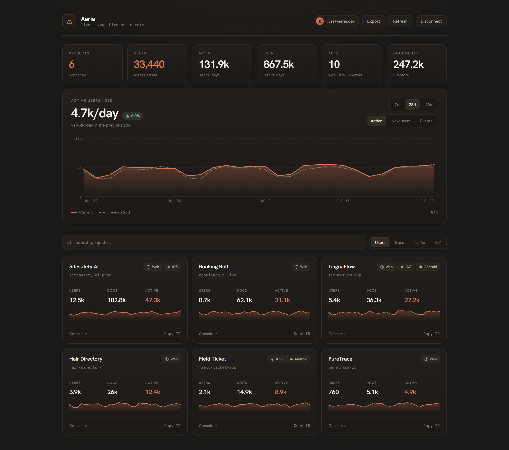

# Aerie

**One dashboard for every Firebase project you own.** Connect once, see all your
projects, apps, users, Firestore and traffic in a single pane — instead of
clicking through the Firebase console project by project.



This repo contains the **live reader app**: a login-gated, per-user dashboard.
A user clicks *Continue with Google*, grants Google Cloud scopes, and their
entire Firebase estate is read **live in the browser** — no server, no stored
tokens, nothing baked into the page. Aerie only ever issues read requests.
Each person only ever sees their own account.

**Cloud version (zero setup):** https://aerie-dashboard-app.web.app — free for
up to 3 projects; a Pro tier ($9/mo billed yearly with a 7-day trial, or
$19 month-to-month) unlocks unlimited projects and the hosted AI analyst.
**Self-hosting is free forever** with every feature — see
[Deploy your own](#deploy-your-own).

---

## What the app does

- **Continue with Google** — Google Identity Services requests `cloud-platform`
  and `analytics.readonly`. `cloud-platform` is not the read-only variant
  (Firestore `listCollectionIds` and Identity Toolkit `accounts:query` reject
  that one), so the grant permits writes even though Aerie only ever issues
  reads. The access token stays in the browser for the session, cached with
  expiry so reloads don't re-prompt; it is never sent to Aerie's backend — the
  cloud build mints a separate identity-only token (`openid email profile`) for
  the billing endpoints.
- **Overview** — projects, total users, apps, Firestore documents, and GA4
  active users / events across the whole estate, plus an account-wide traffic
  chart (metric toggle: Active / New users / Events · range toggle: 7 / 28 / 90
  days · GA-style previous-period comparison line) and per-project sparklines.
- **Search + sort** projects by users, documents, traffic, or name.
- **Project detail** — a full analytics page per project: a Traffic ↔ Signups
  chart on a shared 7/28/90-day axis with previous-period comparison, GA4
  realtime "online now", Vercel-style breakdowns (top pages, sources,
  countries, devices, operating systems, events, sign-in methods), Firestore
  collections + document counts, and the rest of the estate: Cloud Functions,
  Storage buckets, Hosting sites, and Realtime Database instances.
- **Billing Watchdog** — per project: billing plan (Blaze/Spark), the billable
  usage meters (Firestore reads/writes/deletes, Function invocations, Hosting &
  Realtime DB bandwidth, Cloud Storage bytes) over the last 28 days, an
  estimated usage cost (list prices, free tier applied), and **spike warnings**
  when a meter jumps week-over-week — the "wake up to a huge Firebase bill"
  early-warning. Also an estate-wide on-demand scan on the overview. Estimates
  only — Google exposes no exact-spend API without a BigQuery billing export.
- **AI analyst** — one click streams ranked insights + recommended actions
  from the project's real numbers. Bring your own key from Anthropic, OpenAI,
  Google Gemini, xAI or Groq (auto-detected by prefix); the key lives in your
  browser and calls go straight to the provider.
- **Export** — download the whole estate as a JSON snapshot or a per-project CSV,
  entirely client-side.
- **Deep links** — jump to any project in the Firebase console, copy a project
  ID from a card or the detail view.
- **Everything is live and real.** Failed API calls surface an inline
  diagnostic instead of a fake number; services a project doesn't use stay quiet.

### How the data is read (all client-side, read-only)

- **Firebase Management API** — projects + apps.
- **Identity Toolkit** (`accounts:query`) — user counts; per-project breakdowns
  are pulled lazily on the detail view and aggregated in memory (never stored).
- **Firestore** (`listCollectionIds` + `runAggregationQuery`) — collection and
  document counts.
- **GA4 Data API** (`runReport`) — active users, new users, events, views.
- **Cloud Functions / Cloud Storage / Firebase Hosting / Realtime Database** —
  per-project resource lists, read lazily on the detail view.
- **Cloud Billing API** (`projects/*/billingInfo`) — whether billing is
  attached (Blaze vs Spark). Read-only; no spend data.
- **Cloud Monitoring API** (`timeSeries.list`) — daily billable usage meters
  for the Billing Watchdog. Cost figures are estimated client-side from list
  prices; nothing is stored.

### Deploy your own

Static export to Firebase Hosting (Spark/free). You need a Google OAuth **Web
Client ID** (set `NEXT_PUBLIC_GOOGLE_CLIENT_ID`) and these APIs enabled on the
hosting project: Firebase Management, Cloud Firestore, Identity Toolkit, Google
Analytics Data — plus Cloud Billing and Cloud Monitoring for the Billing
Watchdog. Then `cd web && npm run build && firebase deploy --only hosting`.

**Automated deploys.** `.github/workflows/deploy.yml` builds the static export
and deploys to the live channel on every push to `main` (or a manual *Run
workflow*). Add a single repo secret — `FIREBASE_SERVICE_ACCOUNT`, a Firebase
service-account JSON — under **Settings → Secrets and variables → Actions**.
The service account needs deploy permission on the project: the simplest is the
*Editor* role, or least-privilege *Firebase Admin* + *Service Usage Consumer*
(granted in Google Cloud Console → IAM). No other secrets are needed — the
Google OAuth Client ID ships in the client bundle with a committed fallback.

## CLI

`aerie` gives you the same reader in the terminal (zero dependencies, reuses
`core/reader.mjs`). Add `--json` to any command for machine/agent output.

```bash
node cli/aerie.mjs overview            # account-wide rollup
node cli/aerie.mjs projects            # every project + signals
node cli/aerie.mjs apps <projectId>    # a project's apps
node cli/aerie.mjs project <projectId> # full detail
node cli/aerie.mjs snapshot --out x.json
```

## MCP server

An MCP server exposes the reader as tools so agents (Claude, etc.) can query
your Firebase estate. Read-only. Register it with Claude Code:

```bash
cd mcp && npm install
claude mcp add aerie -- node "$(pwd)/server.mjs"
```

Tools: `aerie_overview`, `aerie_list_projects`, `aerie_get_project`,
`aerie_list_apps`.

## Architecture

- **Frontend:** Next.js (App Router) + Tailwind, exported as a fully static site
  and deployed to Firebase Hosting (Spark/free tier — no backend).
- **Auth + data:** the browser runs Google Identity Services for OAuth and calls
  Google's REST APIs directly with the user's token (`web/lib/oauth.ts`,
  `web/lib/live.ts`). No server holds tokens or data.
- **CLI / MCP** (below) are an alternate, owner-side path over the same estate,
  authenticating via the Firebase CLI (`core/reader.mjs`).

## Run / deploy

```bash
cd web
npm install
NEXT_PUBLIC_GOOGLE_CLIENT_ID=<your-web-client-id> npm run build   # → web/out
cd .. && firebase deploy --only hosting
```

## Verification harness

`scripts/verify-live.mjs` drives the OAuth-gated app end-to-end in headless
Chromium with every external API mocked (Playwright route interception), so
changes can be asserted without a real Google login:

```bash
cd scripts && npm install
npm run verify                                   # against the live site
TARGET_URL=http://localhost:4174 npm run verify  # against a local build
```

`scripts/lp-shots.mjs` regenerates the marketing screenshots in
`web/public/shots/` from a mocked six-project estate.

## License

**AGPL-3.0** — free to self-host and modify; derivative network services must
also publish their source. See [LICENSE](./LICENSE).

## Roadmap

Near-term: alerts (traffic drops, signup surges) and a weekly email/Slack
digest, project-history beyond GA4's window, and shareable read-only
dashboards. Issues and PRs welcome.

## Cloud vs self-hosted

The hosted cloud build sets `NEXT_PUBLIC_AERIE_CLOUD=1` at build time, which
enables the free-tier limits shown on the landing page. Builds without that
variable — i.e. every self-hosted deployment of this repo — have **no gating
at all**: unlimited projects, all ranges, everything.
